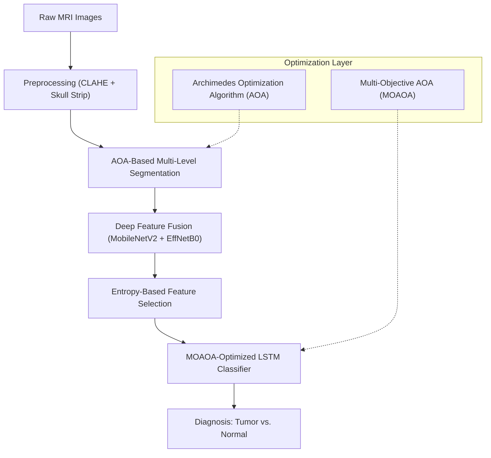

# Presentation Guide: Brain Tumor Classification via MOAOA-FDL

This guide provides a structured 10-slide outline for presenting the **MOAOA-FDL** project to an academic board or professors. It focuses on the technical innovations in optimization, fusion-based deep learning, and comparative performance.

---

## 🏗️ System Architecture

---

## 📋 10-Slide Presentation Outline

### Slide 1: Title Slide
*   **Title**: MOAOA-FDL: A Multi-Objective Archimedes Optimization Algorithm with Fusion-based Deep Learning for Brain Tumor Classification.
*   **Visual**: A high-contrast MRI image showing a tumor and the project title.
*   **Talking Points**:
    *   Introduce the core problem: Automating brain tumor diagnosis to assist radiologists.
    *   Highlight the two-pronged approach: Meta-heuristic optimization (AOA) and Deep Learning (LSTM).

### Slide 2: Motivation & Problem Statement
*   **Content**: Challenges in MRI analysis (noise, low contrast, boundary ambiguity).
*   **Talking Points**:
    *   Manual diagnosis is time-consuming and prone to observer variability.
    *   Proposed goal: Achieve high accuracy using a hybrid model that fuses global and local features.

### Slide 3: Proposed Methodology Overview
*   **Visual**: The Mermaid architecture diagram (above).
*   **Talking Points**:
    *   Briefly walk through the pipeline: Preprocessing → Segmentation → Fusion → Selection → Classification.
    *   Stress the importance of the **Archimedes Optimization Algorithm** in two different stages (Segmentation and Training).

### Slide 4: Image Preprocessing & Skull Stripping
*   **Content**: Before/After of Skull Stripping and CLAHE.
*   **Talking Points**:
    *   **Skull Stripping**: Removes non-brain tissue using distance-transform based masking to prevent feature contamination.
    *   **CLAHE**: Enhances contrast for better thresholding in the next stage.
    *   **Augmentation**: Addressing the small dataset handled by Kaggle to prevent Overfitting.

### Slide 5: Segmentation using AOA and Shannon Entropy
*   **Content**: Visualization of the multi-level thresholded images.
*   **Talking Points**:
    *   Instead of simple Otsu, we use **Multi-level Thresholding**.
    *   Fitness Function: **Shannon Entropy** (maximizes information content).
    *   **AOA** is used to find the global optimum thresholds, avoiding local minima.

### Slide 6: Hybrid Deep Feature Fusion
*   **Content**: Dual-pathway diagram: MobileNet-V2 + EfficientNet-B0.
*   **Talking Points**:
    *   **MobileNet-V2**: Efficient at capturing high-level spatial dependencies.
    *   **EfficientNet-B0**: Balances depth, width, and resolution for robust feature maps.
    *   **Fusion**: Concatenating features to create a rich 2560-dimensional representation.

### Slide 7: Feature Selection & MOAOA Tuning
*   **Content**: Graph showing entropy-based selection (Top 1186 features).
*   **Talking Points**:
    *   **Entropy Selection**: Reduces dimensionality by keeping only highly informative features.
    *   **MOAOA-LSTM**: The LSTM hyperparameters (Learning Rate, Hidden size) are tuned using **Multi-Objective AOA**, balancing Error vs. Stability.

### Slide 8: Experimental Results (Metrics)
*   **Content**: Table of results.
| Metric | Value |
| :--- | :--- |
| **Accuracy** | **94.97%** |
| **Sensitivity** | 93.88% |
| **Specificity** | 95.67% |
| **F-Score** | 94.98% |
| **MCC** | 0.8944 |
| **Kappa** | 0.8944 |

### Slide 9: Comparative Analysis
*   **Visual**: Bar chart comparing results to SVM, RF, and k-NN.
*   **Reference Plot**: [accuracy_comparison.png](file:///c:/Users/chara/Desktop/Opti%20Project/Opti-Project/data/results/accuracy_comparison.png).
*   **Talking Points**:
    *   Our model outperforms traditional classifiers significantly in Sensitivity and MCC, which are critical in medical diagnosis.

### Slide 10: Conclusion & Pedagogical Feature
*   **Talking Points**:
    *   Summary: A robust, end-to-end diagnosis pipeline using AOA-based metaheuristics.
    *   **Pedagogical Contribution**: Mention that the implementation was refactored with a **"Student-Centric"** approach (humanised code), making the advanced logic accessible for educational purposes while maintaining production-level accuracy.

---

## 📈 Key Visual Assets
The following files in your directory should be used to populate your slides:
- **Confusion Matrix**: [confusion_matrix.png](file:///c:/Users/chara/Desktop/Opti%20Project/Opti-Project/data/results/confusion_matrix.png)
- **Training Curves**: [accuracy_curve.png](file:///c:/Users/chara/Desktop/Opti%20Project/Opti-Project/data/results/accuracy_curve.png)
- **Comparison Chart**: [accuracy_comparison.png](file:///c:/Users/chara/Desktop/Opti%20Project/Opti-Project/data/results/accuracy_comparison.png)

---

> [!TIP]
> **Pro-Tip for Professors**: If asked about the Multi-Objective part of MOAOA, explain that it doesn't just look for "high accuracy," but also optimizes for model stability (variance) and computational cost (search space).
